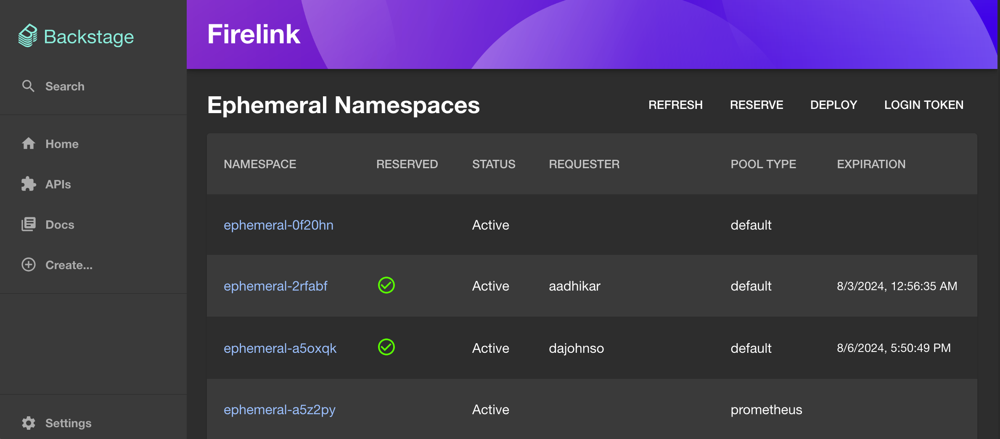

# Firelink Plugin


This is the development monorepo for the [Firelink](https://github.com/RedHatInsights/firelink-frontend) plugin for Backstage / Janus IDP / RHDH. This plugin provides an overview of namespaces on an ephemeral cluster managed by the [Ephemeral Namespace Operator](https://github.com/RedHatInsights/ephemeral-namespace-operator), and then links out to Firelink and the Hybrid Cloud Console on an Ephemeral Cluster to do work.

## Requirements
* An ephemeral cluster running on OpenShift, managed by the Ephemeral Namespace Operator
* API access to said ephemeral cluster
* Firelink deployed in your environment and configured for that same ephemeral cluster

## Development
It is recommended you use Node 18 when running and developing this, though other versions may work.

```sh
yarn install
yarn dev
```
Then navigate to `http://localhost:3000/firelink` in your browser. The code for the plugin is located in `plugins/firelink` in the monorepo.

## Configuration
You'll need to set 4 environment variables for the plugin to function:

```sh
# The URL to your firelink-frontend instance
export FIRELINK_APP_URL="https://firelink.my-company.com"

# The URL to the cloud console for your ephemeral cluster
export FIRELINK_EPHEMERAL_CONSOLE_URL="https://console-openshift-console.apps.my-cluster.my-company.openshiftapps.com"

# The URL to your ephemeral cluster's API, including port
export FIRELINK_EPHEMERAL_API_URL="https://api.my-cluster.my-company.openshiftapps.com:6443"

# The token for accessing your ephemeral cluster API
export FIRELINK_EPHEMERAL_API_TOKEN="sha256~DEADBEEF7337DEADBEEF7337DEADBEEF7337DEADBEEF7337"
```

You'll then need to add the following to your `app-config.yaml`

```yaml
app:
  firelink:
    firelinkUrl: ${FIRELINK_APP_URL}
    ephemeralUrl: ${FIRELINK_EPHEMERAL_CONSOLE_URL}

proxy:
  endpoints:
    "/ephemeral":
      target: "${FIRELINK_EPHEMERAL_API_URL}"
      credentials: dangerously-allow-unauthenticated
      headers:
        Authorization: "Bearer ${FIRELINK_EPHEMERAL_API_TOKEN}"
      changeOrigin: true
```

## Dynamic Plugin Config for RHDH
Add the following to your dynamic plugin config:

```yaml
- package: "https://github.com/RedHatInsights/backstage-plugin-firelink/releases/download/<TAG>/<TARBALL>"
disabled: false
integrity: "sha256-<INTEGRITY>"
pluginConfig:
    dynamicPlugins:
    frontend:
        redhatinsights.backstage-plugin-firelink:
        dynamicRoutes:
            - path: /firelink
            importName: FirelinkPage
            menuItem:
                icon: 'kind:resource'
                text: Firelink
```

