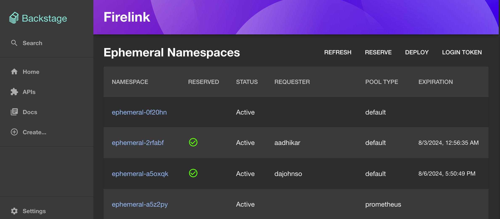

# Firelink Plugin



This is the development monorepo for the [Firelink](https://github.com/RedHatInsights/firelink-frontend) plugin for Backstage / Janus IDP / RHDH. This plugin provides an overview of namespaces on an ephemeral cluster managed by the [Ephemeral Namespace Operator](https://github.com/RedHatInsights/ephemeral-namespace-operator), and then links out to Firelink and the Hybrid Cloud Console on an Ephemeral Cluster to do work.

## Overview

The Firelink plugin is a frontend-only Backstage plugin that displays ephemeral namespaces and their reservation status. It integrates with:
- **Kubernetes API** on your ephemeral cluster (via Backstage proxy)
- **Firelink frontend** for namespace reservation and deployment workflows
- **OpenShift Console** for cluster access

For architecture details and design decisions, see [ARCHITECTURE.md](./ARCHITECTURE.md).

## Requirements

- **Node.js:** Version 22 or 24 (as specified in `package.json`)
- **Yarn:** Version 4.4.1 (managed via `packageManager` field)
- **An ephemeral cluster** running on OpenShift, managed by the [Ephemeral Namespace Operator](https://github.com/RedHatInsights/ephemeral-namespace-operator)
- **API access** to the ephemeral cluster (with a service account token or similar)
- **Firelink** deployed in your environment and configured for that same ephemeral cluster

## Development

### Local Setup

1. Install dependencies:
   ```sh
   yarn install
   ```

2. Set required environment variables (see [Configuration](#configuration) below).

3. Start the development server:
   ```sh
   yarn dev
   ```

4. Navigate to `http://localhost:3000/firelink` in your browser.

The plugin code is located in `plugins/firelink` within the monorepo. The `packages/app` and `packages/backend` directories provide a full Backstage instance for development and testing.

### Running Tests

```sh
# Run all unit tests
yarn test

# Run tests with coverage
yarn test:all

# Run end-to-end tests
yarn test:e2e
```

### Linting and Formatting

```sh
# Lint all packages
yarn lint:all

# Check formatting
yarn prettier:check

# Auto-fix linting and formatting issues
yarn fix
```

### Building

```sh
# Build all packages
yarn build:all

# Build just the backend
yarn build:backend

# Build the plugin as a dynamic plugin for RHDH
cd plugins/firelink
yarn export-dynamic
```

## Configuration
You'll need to set 4 environment variables for the plugin to function:

```sh
# The URL to your firelink-frontend instance
export FIRELINK_APP_URL="https://firelink.my-company.com"

# The URL to the cloud console for your ephemeral cluster
export FIRELINK_EPHEMERAL_CONSOLE_URL="https://console-openshift-console.apps.my-cluster.my-company.openshiftapps.com"

# The URL to your ephemeral cluster's API, including port
export FIRELINK_EPHEMERAL_API_URL="https://api.my-cluster.my-company.openshiftapps.com:6443"

# The token for accessing your ephemeral cluster API
export FIRELINK_EPHEMERAL_API_TOKEN="sha256~DEADBEEF7337DEADBEEF7337DEADBEEF7337DEADBEEF7337"
```

You'll then need to add the following to your `app-config.yaml`

```yaml
app:
  firelink:
    firelinkUrl: ${FIRELINK_APP_URL}
    ephemeralUrl: ${FIRELINK_EPHEMERAL_CONSOLE_URL}

proxy:
  endpoints:
    "/ephemeral":
      target: "${FIRELINK_EPHEMERAL_API_URL}"
      credentials: dangerously-allow-unauthenticated
      headers:
        Authorization: "Bearer ${FIRELINK_EPHEMERAL_API_TOKEN}"
      changeOrigin: true
```

## Deploying as a Dynamic Plugin (RHDH)

The Firelink plugin can be packaged as a dynamic plugin for Red Hat Developer Hub (RHDH). This allows installation without rebuilding the entire Backstage application.

### Building the Dynamic Plugin

```sh
cd plugins/firelink
yarn export-dynamic
```

This generates a dynamic plugin bundle in `dist-scalprum/`.

### Dynamic Plugin Configuration

Add the following to your RHDH dynamic plugin config:

```yaml
- package: "https://github.com/RedHatInsights/backstage-plugin-firelink/releases/download/<TAG>/<TARBALL>"
  disabled: false
  integrity: "sha256-<INTEGRITY>"
  pluginConfig:
    dynamicPlugins:
      frontend:
        redhatinsights.backstage-plugin-firelink:
          dynamicRoutes:
            - path: /firelink
              importName: FirelinkPage
              menuItem:
                icon: 'kind:resource'
                text: Firelink
```

Replace `<TAG>`, `<TARBALL>`, and `<INTEGRITY>` with values from the release you're deploying.

## Contributing

Contributions are welcome! Please read [CONTRIBUTING.md](./CONTRIBUTING.md) for guidelines on development workflow, commit messages, and code review.

## License

This project is licensed under the Apache License 2.0. See the plugin's `package.json` for details.

